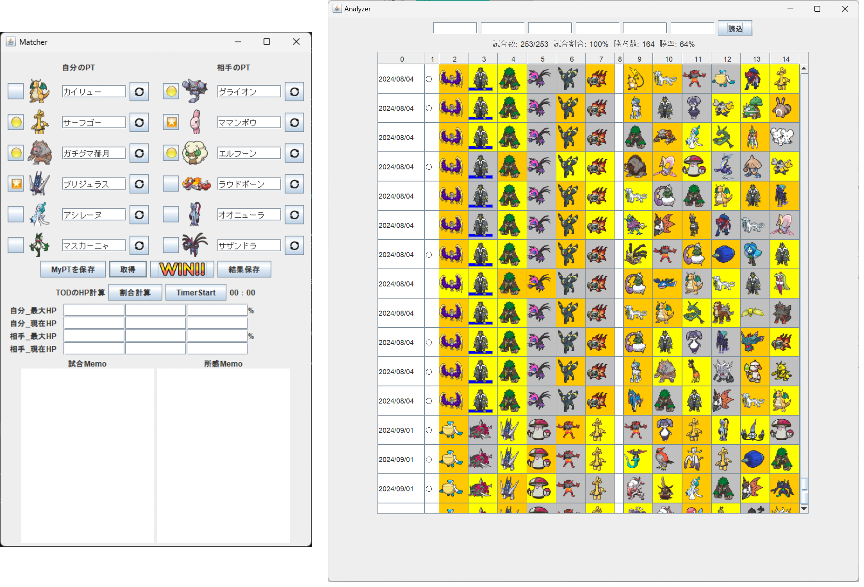

# Pokemon Match Recoder



- Matcher
  - 対戦結果を入力するための GUI
- Analyzer
  - 対戦結果を見るための GUI

# フォルダ構成

DL 後、以下のフォルダ構成にしてください。

```
root
├─database
│  ├─image
│  │  ├─elect
│  │  │      ...
│  │  │
│  │  ├─icon
│  │  │      fetch_all.bat
│  │  │      fetch_all.py
│  │  │
│  │  └─result
│  │          ...
│  │
│  └─text
│          pokemon.csv
│
└─PokemonMatchRecoder
        Analyzer.jar
        Matcher.jar
        myPT.csv
        resultData.csv
```

`database`フォルダは`PokemonMatchRecoder`の外のディレクトリになります。

databse フォルダの`fetch_all.py`を実行してポケモンのアイコン画像を DL してください。
もしくは`fetch_all.bat`の実行でも DL 可能です。
bat ファイルはエラー時の処理を行っていないため、DL に失敗したアイコンがあった場合は手動で DL してください。

## 画像について

画像の都合上、フォルム違いでも同じアイコンが DL されるものがあります（eg. ウーラオス水、悪）。
必要に応じて判別できる画像に差し替えて使用してください。
